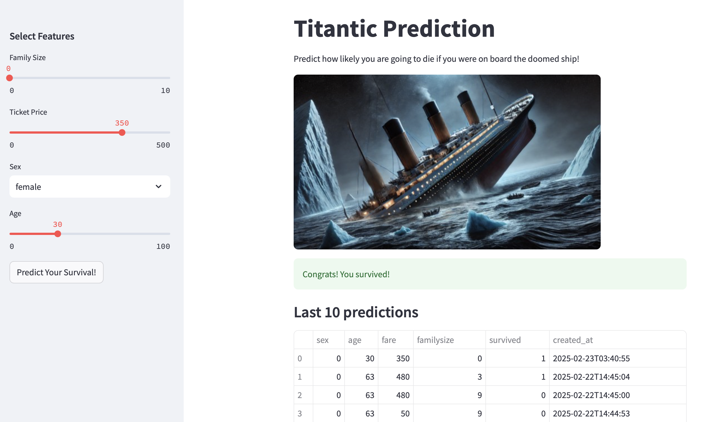
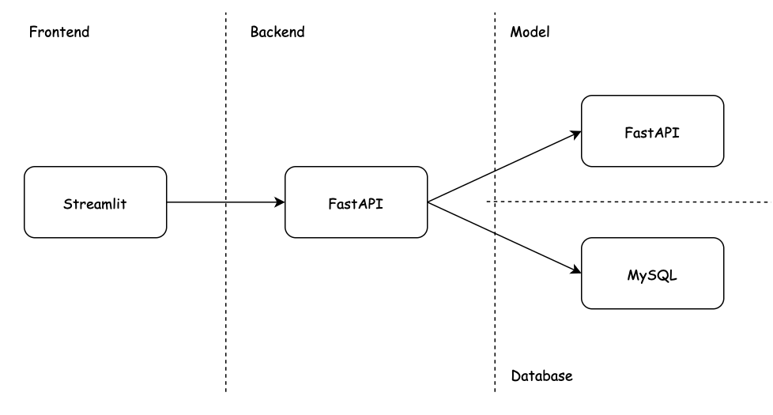

# Titanic Demo App

The purpose of this experiment is to design a simple 3 tier architecture with  frontend, backend, model and database servers. This will allow us to test its implementation in Kubernetes. Refer to this medium article for more details.



This application predicts the survivability of a person based on certain attributes. Historical predictions are also shown.


### Architecture



- Frontend: Streamlit
- Backend: FastAPI
- Model: FastAPI (with random forest model)
- Database: MySQL


### Local Deployment

Run the `docker-compose.yml` file.

```bash
docker compose build
docker compose up -d
```
